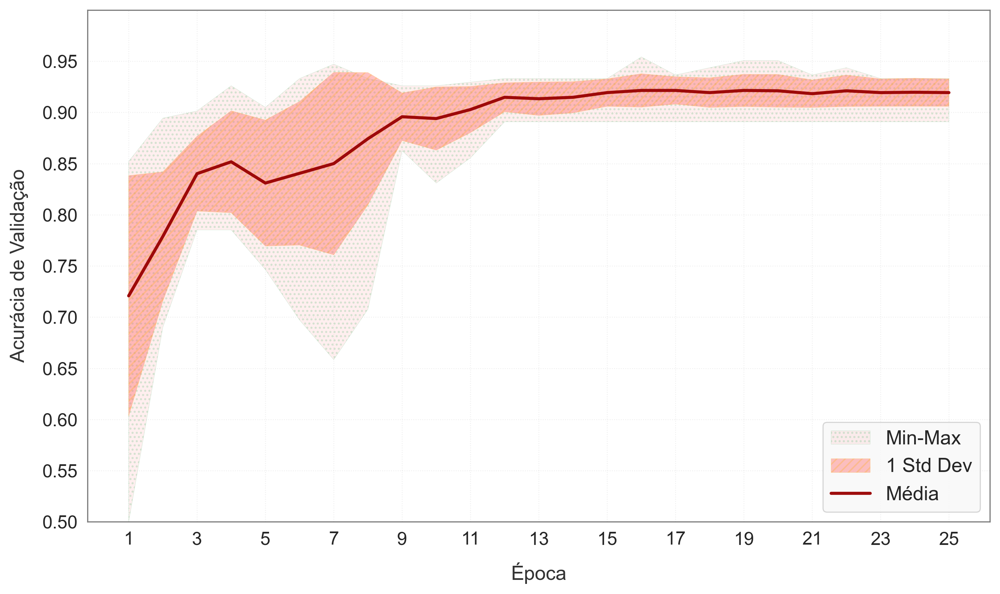

# Application of Convolutional Neural Networks in the Identification of Counterfeit Banknotes

This work presents a comparative study of convolutional neural network architectures applied to the detection of counterfeit banknotes using computer vision techniques. 

The main objective was to evaluate the performance of the AlexNet, DenseNet121, EfficientNet-B0, and ResNet-50 models in the task of image classification, using a dataset of real and counterfeit banknotes. The dataset consists of banknotes from Bangladesh, with high quality real samples from both origins (authentic and counterfeit).

The methodology involved image preprocessing, data augmentation techniques, and model training with multiple random seeds to ensure statistical robustness. 

Evaluation metrics included accuracy, standard deviation, and stability across runs.The results showed that AlexNet achieved the best overall performance, with test accuracy reaching up to 97.75% and high consistency between executions.

ResNet-50 also performed well, although at a higher computational cost. DenseNet121 yielded consistent results, while EfficientNet-B0 underperformed, possibly due to its sensitivity to dataset size and hyperparameter configuration. 

It is concluded that simpler models such as AlexNet can be highly effective in specific classification tasks when properly tuned and combined with appropriate validation and data augmentation strategies.
